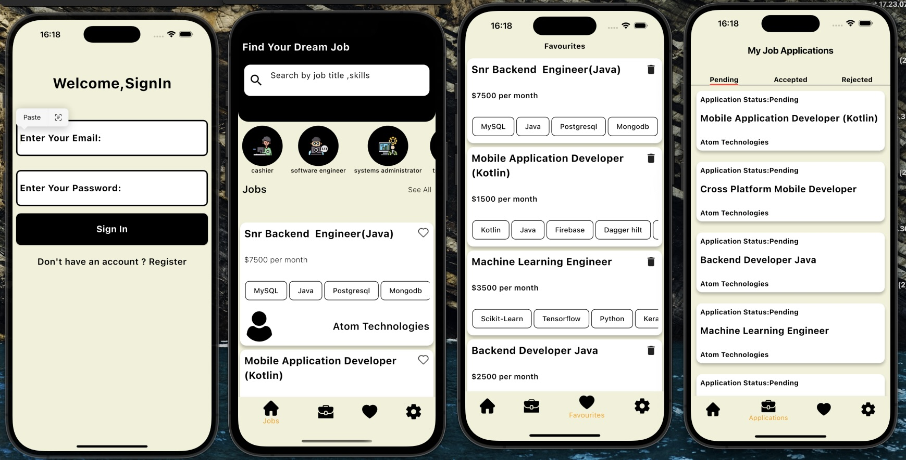

# 💼 JobBoard App

A full-stack Job Board web application that allows users to browse job vacancies, save their favorite listings, upload resumes, and send applications directly to employers.

This app features a robust RESTful API built with **Express.js** and **MongoDB**, enabling seamless job listing management and user interaction.

---

## 🚀 Features

### 👨‍💼 User Features
- 🕵️ Browse available job vacancies
- ⭐ Add jobs to favorites
- 📄 Upload and manage resumes
- 📬 Submit job applications

### ⚙️ API Features
- ✅ RESTful API using **Express.js**
- 🗃️ MongoDB for data persistence
- 🔐 JWT-based authentication and authorization
- 🧑‍💻 Admin routes for posting, updating, and deleting jobs

---

## 🛠️ Tech Stack

- **Frontend**: _Coming soon / Integrate with any front-end framework_
- **Backend**: [Express.js](https://expressjs.com/)
- **Database**: [MongoDB](https://www.mongodb.com/)
- **Authentication**: JWT (JSON Web Tokens)
- **ORM**: Mongoose

---

## 📦 Installation

1. **Clone the repository**

```bash
git clone https://github.com/isheunesutembo/jobhunt.git
cd jobhunt


